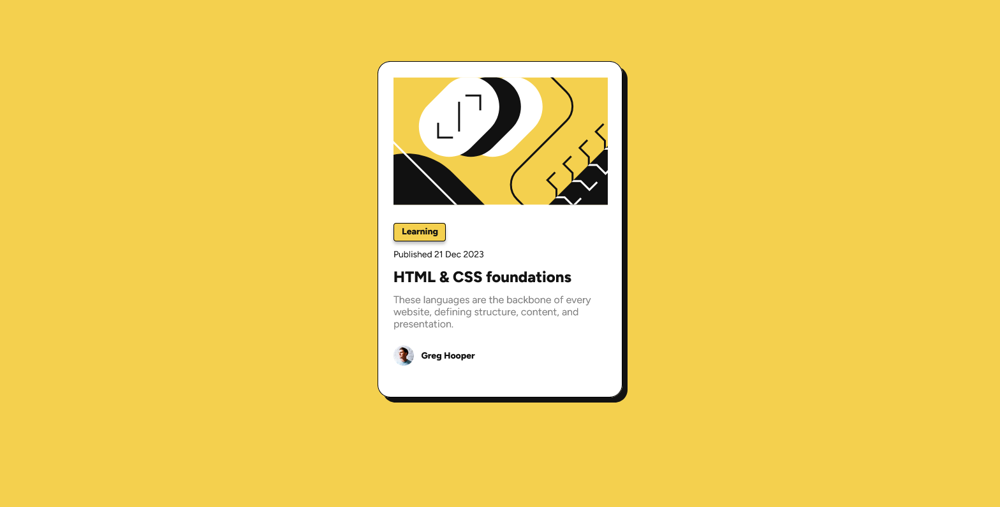

# Frontend Mentor - Blog preview card solution

This is a solution to the [Blog preview card challenge on Frontend Mentor](https://www.frontendmentor.io/challenges/blog-preview-card-ckPaj01IcS). Frontend Mentor challenges help you improve your coding skills by building realistic projects.

## Table of contents

- [The challenge](#the-challenge)
- [Screenshot](#screenshot)
- [Links](#links)
- [What I learned](#what-i-learned)
- [Continued development](#continued-development)
- [Useful resources](#useful-resources)

### The challenge

Users should be able to:

- See hover and focus states for all interactive elements on the page

### Screenshot

### Links

- [Solution URL:](https://your-solution-url.com)
- [Live Site URL:](https://lando241.github.io/blog-preview-card-frontend-mentor/)

### Built with

- Semantic HTML5 markup
- CSS custom properties
- Flexbox

### What I learned

Simple Blog preview card. The biggest thing learned with building this project was being able to utilize Figma to assist with making the correct style choices.

### Continued development

Looking forward to implementing more styles from Figma. Would also like more practice with SVG's as I had issues with sizing the SVG to the proper proportions.

### Useful resources

- [Figma](https://www.figma.com/) - Helped in understanding the proper sizes for fonts, gaps, padding and margin.
